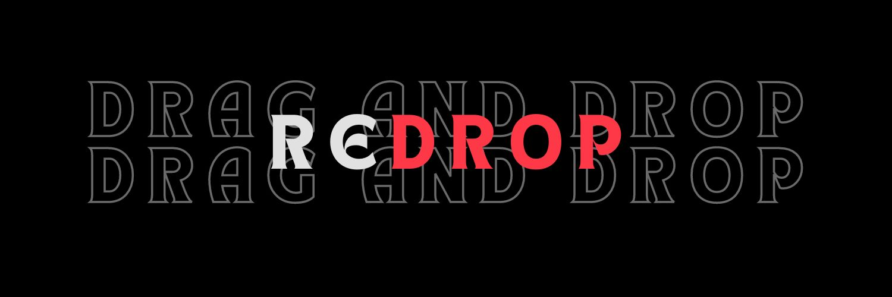

<h2 align="center">
  
</h2>

<h4 align="center">Drag and Drop made simple with ReDrop</h4>

  <a href="#about">About</a> •
  <a href="#features">Features</a> •
  <a href="#installation">Installation</a> •
  <a href="#current-state">Current State</a> •
  <a href="#how-to-contribute">Contribute</a> •
  <a href="#contact">contact</a> 

## ReDrop: A Simplified JavaScript Drag and Drop Library

> [!IMPORTANT]  
> ReDrop is not recommended to be used in production environment as it may contains bugs. I created this library as a drag and drop protoype and it does not necessarily follow all the best practices. ReDrop is best suited for hobby and protfolio projects because of it's simplicity and quick to setup nature.

#### About

ReDrop is a JavaScript drag and drop library, offering an intuitive alternative to the native HTML5 drag and drop API. ReDrop tries to make drag and drop as simple, quick and easy as possible. ReDrop is not built on top of HTML5 drag and drop API because of it's limitations. Under the hood ReDrop uses pointer events to simulate drag and drop with added features.

Get a quick overview of the Redrop [here](./resources/docs/overview.md) or checkout the doc.md file in the repository.

#### Purpose

The purpose behind creating ReDrop is to address the shortcomings of the native HTML5 drag and drop API. If you've ever used the HTML5 drag and drop API, you're likely aware of its limitations for modern web applications and how outdated it can feel.

During my previous job, I encountered these limitations firsthand when tasked with creating a drag and drop system for our React application. Despite searching for a suitable library, I couldn't find one that met our needs. Consequently, I had to develop a custom solution using the native API, which highlighted its shortcomings.

Isn't it odd that a core JavaScript API, meant to facilitate drag and drop functionality, falls short on mobile devices despite its desktop compatibility? While browser providers share some blame for improper implementation on mobile, the native API itself lacks adequate support and updates.

For more insights into the challenges posed by HTML5 drag and drop, feel free to explore [this](https://news.ycombinator.com/item?id=834314) article further.

## Features

- Easy to setup. Unlike native api you don't need to do multiple things to just make a single element draggable or droppable.You can just pass in the css selectors(class, id, tag, attribute selector, etc) and you're good to go. You don't even need to set up an event listener. Everything is handled for you.
- Give you extra control of your drag and drop elements by providing additional data that is usefull in managing drag and drop applications. For example, it maintains the list of all drag and drop elements with its current state.
- Provide all events that are avaialble in HTML5 drag and drop API. You can listen to ondragstart, ondrag, ondragend, ondragenter, ondragleave, ondragover, ondrop, ondragend.
- Unlike HTML5 drag and drop API, ReDrop works well both on desktop and mobile devices. Under the hood it utilizes pointer events to simulate drag and drop.

## Installation

Installation guide will soon be updated. I am currently working on creating the docs.

## Current State

The base version of the library is ready. I have tested all the feature manually and do not plan to setup any automated tests in the future. Currently I am not aware about any known bugs but as I can not test manually for all teh use cases so there will be bugs. If you are using the library and need help, feel free to [open an issue](https://github.com/gokunik/Redrop/issues).

## How to Contribute

If you have any suggestions or questions, please feel free to [open an issue](https://github.com/gokunik/Redrop/issues). For know you can create a issue or get in touch with me on [Github](https://github.com/gokunik) or through my socials if you want to contribute.

## Contact

- GitHub: [https://github.com/gokunik](https://github.com/gokunik)
- Twitter: [https://twitter.com/goku_nik](https://twitter.com/goku_nik)
- LinkedIn: [https://www.linkedin.com/in/gokunik/](https://www.linkedin.com/in/gokunik/)
- Email: niteshkhatri545@gmail.com
